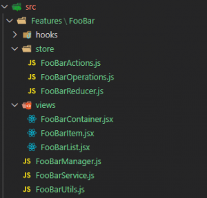

# TheWall APP

To run this project locally run following commands:

    yarn
    yarn start

## Environment Variables

In order to run the api locally you will need to set the following properties in a .env.test file, located in projects root directory:

    REACT_APP_API_URL=[Url of the api that the app will use]

## Design pattern
Follows feature/responsibility pattern

Pages folder was separed to improve readability.

## Dependencies

Main dependencies:

- axios
- materialUI

## Deployment

Hosted at [Heroku](https://www.heroku.com/) on https://the-wall-tsl-app.herokuapp.com/

## Future Improvements

 - State control: Could use a state control framework to keep information about the user session.
 - Pagination: Messages should have pagination options.
 - Improve responsive design.
